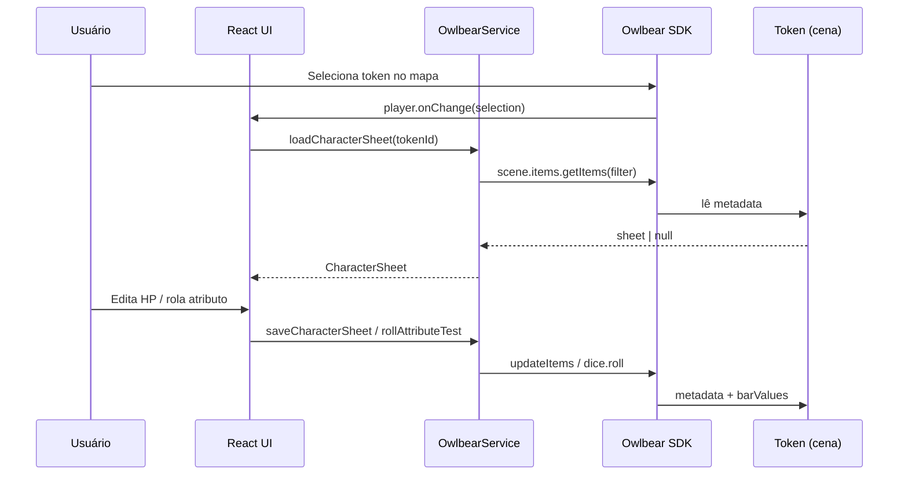

# Especificação Técnica — Dragon Age 2e Helper

| Campo | Valor |
| --- | --- |
| **Projeto** | Dragon Age / Fantasy AGE 2e Helper |
| **Plataforma** | [Owlbear Rodeo 2.0](https://www.owlbear.rodeo/) (extensão em iframe) |
| **Repositório** | `Dragon-Age-2e-Helper` |
| **App** | `dragon-age-helper/` (React 19 + TypeScript + Vite 8) |
| **SDK** | `@owlbear-rodeo/sdk` ^3.1.0 |
| **Versão do documento** | 2.0.0 |
| **Última revisão** | 2026-05-26 |

---

## Índice

1. [Visão geral](#1-visão-geral)
2. [Glossário e terminologia](#2-glossário-e-terminologia)
3. [Arquitetura de software](#3-arquitetura-de-software)
4. [Integração Owlbear Rodeo](#4-integração-owlbear-rodeo)
5. [Regras de jogo (AGE / Dragon Age 2e)](#5-regras-de-jogo-age--dragon-age-2e)
6. [Contratos de dados](#6-contratos-de-dados)
7. [Requisitos funcionais](#7-requisitos-funcionais)
8. [Regras de negócio](#8-regras-de-negócio)
9. [Interface do usuário](#9-interface-do-usuário)
10. [Backend e persistência externa](#10-backend-e-persistência-externa)
11. [Roadmap de implementação](#11-roadmap-de-implementação)
12. [Referências](#12-referências)

---

## 1. Visão geral

### 1.1 Objetivo

Extensão customizada para **Owlbear Rodeo 2.0** que:

- Exibe e edita fichas de personagem do sistema **Dragon Age RPG** (homebrew baseado em **Fantasy AGE 2nd Edition**).
- Automatiza rolagens **3d6** com **Dado do Dragão** e detecção de **Façanhas**.
- Sincroniza **Saúde (HP)** e **Mana (MP)** com tokens da cena via metadata e barras visuais.
- (Planejado) Consome fichas completas de uma API externa alimentada por planilhas das jogadoras.

### 1.2 Escopo atual vs. planejado

| Área | Status | Observação |
| --- | --- | --- |
| Manifest + action popover | ✅ Implementado | `public/manifest.json` |
| Domínio: atributos, HP/MP, façanhas | ✅ Implementado | `domain/entities/` |
| Integração Dice+ (`OBR.dice.roll`) | ✅ Implementado | Tipagem via cast `(OBR as any)` |
| Sincronização de trackers no token | ✅ Implementado | `OwlbearService.updateTokenTrackers` |
| UI da ficha (abas, componentes) | ⏳ Pendente | `App.tsx` ainda é template Vite |
| Vínculo ficha ↔ token selecionado | ⏳ Pendente | `tokenId` não populado |
| Persistência completa no metadata | ⏳ Parcial | Apenas `trackers`; falta `sheet` |
| API externa + validação Zod | ⏳ Planejado | Backend não existe no repo |
| Combate, armas, magias, talentos, pet | ⏳ Planejado | RF-002 a RF-007 |

### 1.3 Usuários e permissões

| Papel | Capacidades esperadas |
| --- | --- |
| **Jogador (PLAYER)** | Abrir popover, ver/editar própria ficha vinculada ao token, rolar testes, alterar HP/MP do próprio token (conforme permissões OBR). |
| **Mestre (GM)** | Todas as do jogador + configurar visibilidade de abas (`uiConfig`), editar fichas de NPCs, vincular tokens. |

Detecção de papel: `OBR.player.getRole()` → `"GM" | "PLAYER"`.

---

## 2. Glossário e terminologia

Terminologia alinhada à tradução oficial **Dragon Age RPG** (Brasil) e ao código-fonte.

| Termo (PT) | Termo (EN) | Uso no código / UI |
| --- | --- | --- |
| Façanha | Stunt | `hasStunts`, mensagens de UI |
| Pontos de Façanha | Stunt Points (SP) | `stuntPoints`, sigla **PF** na UI |
| Dado do Dragão | Dragon Die | Terceiro dado na rolagem 3d6; categoria Dice+ `"Dragão"` |
| Dados vermelhos | — | Dois primeiros d6; categoria Dice+ `"Vermelho"` |
| Saúde | Health (HP) | `hpCurrent`, `hpMax` |
| Mana | Mana (MP) | `mpCurrent`, `mpMax` |
| Foco | Focus | Bônus numérico em testes (`Attribute.focus`) |
| Poder Arcano | Spellpower | `10 + VON` (planejado) |

**Convenção de namespace no metadata Owlbear:** prefixo `com.dragonagehelper/` para evitar colisão com outras extensões.

---

## 3. Arquitetura de software

### 3.1 Princípios

- **Clean Architecture:** domínio sem dependência de React, iframe ou rede.
- **Adaptadores:** toda chamada ao SDK Owlbear concentrada em `infrastructure/owlbear/`.
- **TypeScript estrito:** `import type { ... }` para tipos em tempo de compilação (`verbatimModuleSyntax`).

### 3.2 Diagrama de camadas

```
┌─────────────────────────────────────────────────────────┐
│  presentation/                                          │
│  React components, hooks (useUserCharacterSheet, …)     │
└───────────────────────────┬─────────────────────────────┘
                            │ depende de
┌───────────────────────────▼─────────────────────────────┐
│  infrastructure/                                        │
│  owlbear/OwlbearService  ·  api/ApiClient (planejado)   │
└───────────────────────────┬─────────────────────────────┘
                            │ depende de
┌───────────────────────────▼─────────────────────────────┐
│  domain/entities/                                       │
│  characterSheet · diceRules · combat · magic (planejado)│
└─────────────────────────────────────────────────────────┘
```

### 3.3 Estrutura de diretórios

#### Implementado

```
dragon-age-helper/
├── public/
│   ├── manifest.json          # Manifest da extensão Owlbear
│   └── icon.svg               # Ícone da action (a customizar)
├── src/
│   ├── domain/entities/
│   │   ├── characterSheet.ts  # CharacterSheet, Attribute
│   │   └── diceRules.ts       # StuntRollResult, calculateDicePlusStunt
│   ├── infrastructure/owlbear/
│   │   ├── IOwlbearService.ts
│   │   └── OwlbearService.ts
│   ├── presentation/hooks/
│   │   └── userCharacterSheet.ts
│   ├── App.tsx                # (pendente: substituir template Vite)
│   └── main.tsx
└── package.json
```

#### Planejado

```
src/domain/entities/
  combat.ts          # armas, defesa, velocidade, armadura
  magic.ts           # feitiços, escolas arcanas
  talents.ts         # talentos por grau
  companion.ts       # ficha de pet (ex.: Vheballin)

src/infrastructure/api/
  ApiClient.ts       # fetch + validação Zod

src/presentation/components/
  CharacterSheetView.tsx
  AttributeRow.tsx
  ResourceTracker.tsx
  …                  # abas conforme seção 9
```

### 3.4 Diretrizes TypeScript

| Regra | Detalhe |
| --- | --- |
| Import de tipos | Sempre `import type { X } from "..."` |
| Mutação de itens OBR | Usar callback `updateItems` com `Draft<Item>` do Immer (SDK) |
| API Dice+ sem tipos | Declarar módulo local `owlbear-dice.d.ts` em vez de `any` espalhado |
| IDs de metadata | Constantes exportadas, ex.: `METADATA_KEYS.SHEET` |

---

## 4. Integração Owlbear Rodeo

Documentação oficial: [Getting Started](https://docs.owlbear.rodeo/extensions/getting-started/) · [Manifest Reference](https://docs.owlbear.rodeo/extensions/reference/manifest/).

### 4.1 Modelo de execução

A extensão roda como **iframe** embutido no Owlbear. O ponto de entrada é o **Action Popover** definido no manifest; o SDK comunica com a aplicação pai via `@owlbear-rodeo/sdk`.

```
Usuário clica Action → Owlbear carrega popover URL → React app
                              ↓
                    OBR.onReady() → APIs disponíveis
```

### 4.2 Manifest (`public/manifest.json`)

| Campo | Valor atual | Especificação |
| --- | --- | --- |
| `name` | Dragon Age 2e Helper | Máx. 45 caracteres |
| `version` | 1.0.0 | Semver |
| `manifest_version` | 1 | Fixo para OBR 2.0 |
| `action.title` | Dragon Age 2e | Título do botão na sala |
| `action.popover` | `/` | URL da SPA (Vite `index.html`) |
| `action.width` / `height` | 420 × 640 | Dimensões iniciais do popover |

Controle dinâmico pós-carregamento: `OBR.action.setTitle`, `setIcon`, `setBadgeText`, `open` / `close`.

### 4.3 APIs do SDK em uso

| API | Método / evento | Responsabilidade no projeto |
| --- | --- | --- |
| Lifecycle | `OBR.onReady(callback)` | Inicializar UI e listeners após embed |
| Disponibilidade | `OBR.isAvailable`, `OBR.isReady` | Fallback fora do Owlbear (dev local) |
| Dice+ | `(OBR as any).dice.roll(spec)` | Rolagem 3d6 com nomes de dados |
| Cena | `OBR.scene.items.updateItems` | Gravar metadata e `barValues` no token |
| Jogador | `OBR.player.getSelection()` | (planejado) Resolver `tokenId` |
| Jogador | `OBR.player.onChange` | (planejado) Reagir a mudança de seleção |
| Notificação | `OBR.notification.show` | (planejado) Substituir `alert()` |
| Tema | `OBR.theme.getTheme`, `onChange` | (planejado) UI consistente com OBR |

### 4.4 Integração Dice+

**Contrato de rolagem de teste de atributo:**

```typescript
// Envelope retornado pela extensão Dice+ (tipagem local recomendada)
interface DicePlusRollEnvelope {
  orderedD6: [number, number, number]; // [vermelho1, vermelho2, dragão]
  totalValue: number;                   // soma dos 3 d6 (antes do bônus de atributo)
}

// Chamada
await OBR.dice.roll([
  { die: "D6", count: 1, name: "Vermelho" },
  { die: "D6", count: 1, name: "Vermelho" },
  { die: "D6", count: 1, name: "Dragão" },
]);
```

**Pós-processamento (domínio):**

```
bonusTotal     = attribute.value + attribute.focus
finalResult    = envelope.totalValue + bonusTotal
stuntAnalysis  = calculateDicePlusStunt(envelope.orderedD6, finalResult)
```

### 4.5 Metadata e barras no token

Chaves reservadas no `item.metadata`:

| Chave | Tipo | Conteúdo |
| --- | --- | --- |
| `com.dragonagehelper/trackers` | `{ hp, mp }` | `{ current, max }` para cada recurso |
| `com.dragonagehelper/sheet` | `CharacterSheet` | (planejado) Ficha completa serializada |
| `com.dragonagehelper/schemaVersion` | `number` | (planejado) Migração de formato |

**Barras visuais** (`barValues` no item, via cast até tipagem oficial):

```typescript
[
  { current: hpCurrent, max: hpMax, color: "red" },   // Saúde
  { current: mpCurrent, max: mpMax, color: "blue" },  // Mana
]
```

- Tipos de item suportados: `CHARACTER`, `PROP`.
- Se `mpMax === 0`, a UI deve ocultar ou zerar a barra de mana (ex.: classes sem conjuração).

### 4.6 Fluxo: seleção de token → ficha



### 4.7 Interface `IOwlbearService`

Contrato atual do adaptador:

```typescript
interface IOwlbearService {
  onReady(callback: () => void): void;
  rollAttributeTest(attribute: Attribute): Promise<StuntRollResult>;
  updateTokenTrackers(
    tokenId: string,
    hpCurrent: number,
    hpMax: number,
    mpCurrent: number,
    mpMax: number
  ): Promise<void>;
}
```

Métodos planejados:

```typescript
getSelectedTokenId(): Promise<string | null>;
loadCharacterSheet(tokenId: string): Promise<CharacterSheet | null>;
saveCharacterSheet(tokenId: string, sheet: CharacterSheet): Promise<void>;
```

---

## 5. Regras de jogo (AGE / Dragon Age 2e)

### 5.1 Os 9 atributos

| Sigla | Nome | Uso típico |
| --- | --- | --- |
| AST | Astúcia | Conhecimento, magia teórica |
| COM | Comunicação | Social, persuasão |
| CON | Constituição | Resistência, saúde |
| DES | Destreza | Agilidade, esquiva |
| FOR | Força | Força bruta |
| LUT | Luta | Combate corpo a corpo (armas pesadas) |
| PER | Percepção | Sentidos, detecção |
| PRE | Precisão | Ataques à distância, armas de fineza |
| VON | Vontade | Coragem, poder mágico |

### 5.2 Rolagem 3d6 e Façanhas

| Regra | Especificação |
| --- | --- |
| Composição | 2× d6 comuns (**Vermelho**) + 1× **Dado do Dragão** |
| Gatilho de Façanha | Qualquer par ou trinca entre os três valores (`orderedD6[0..2]`) |
| PF (Pontos de Façanha) | Se há façanha: valor do **Dado do Dragão** (`orderedD6[2]`); senão `0` |
| Resultado do teste | `diceTotal + attribute.value + attribute.focus` |

Implementação: `calculateDicePlusStunt()` em `diceRules.ts`.

```typescript
interface StuntRollResult {
  diceValues: number[];
  diceTotal: number;
  hasStunts: boolean;
  stuntPoints: number;   // PF
  finalResult: number;
}
```

### 5.3 Exemplos de mesa (referência de design)

Personagens usados para validar requisitos de UI e dados:

| Personagem | Classe | Notas mecânicas |
| --- | --- | --- |
| Brianna Galmond | Ladina | Armadura de Ladino, Velocidade Ladina; Besta + Espada Curta |
| Nolalya Mahariel | Maga (Guerreira Arcana) | Machado, magias Fogo/Besta; pet **Vheballin** (Mabari) |
| Nohmei | Mago | Arcana de Sangue; escolas Morte/Raio; Lança Arcana + Cajado |
| Loghain Mac Tir | Guerreiro | Mock atual no hook (`userCharacterSheet.ts`) |

---

## 6. Contratos de dados

### 6.1 Domínio — implementado (`characterSheet.ts`)

```typescript
interface Attribute {
  name: string;
  abbreviation: string;   // "AST" | "COM" | …
  value: number;
  focus: number;
  activeFocusName?: string;
}

interface CharacterSheet {
  id: string;
  tokenId?: string;
  name: string;
  className: string;
  level: number;
  hpCurrent: number;
  hpMax: number;
  mpCurrent: number;
  mpMax: number;
  attributes: Attribute[];  // exatamente 9 entradas (validação planejada)
}
```

### 6.2 Domínio — planejado (API / MongoDB)

```typescript
interface CombatStats {
  speed: number;
  defense: number;
  armor: number;
  armorPenalty: number;
}

interface Weapon {
  name: string;
  attackBonus: number;
  damage: string;           // ex.: "3d6+3"
  type: "Melee" | "Ranged" | "MagicRanged";
  reload?: string;          // ex.: "Ação Menor"
}

interface Spell {
  name: string;
  arcana: string;
  cost: number;             // PM
  time: string;
  tn: number;               // NA (Número de Acerto para conjuração)
  test?: string;
  description: string;
}

interface Talent {
  name: string;
  degree: "Novato" | "Experiente" | "Mestre";
  benefit: string;
}

interface CompanionSheet {
  name: string;
  type: string;
  stats: { defense: number; health: HealthPool; speed: number };
  attributes: Attribute[];
  attacks: Weapon[];
  favoriteStunts: string[];
}

interface UiConfig {
  showMagicTab: boolean;
  showCompanionTab: boolean;
  showGrimoireTab: boolean;
}

interface CharacterDocument {
  _id: string;
  name: string;
  className: string;
  level: number;
  combatStats: CombatStats & {
    health: HealthPool;
    mana: HealthPool;
  };
  attributes: Array<{
    name: string;
    abbreviation: string;
    value: number;
    focuses: string[];      // lista de nomes de focos
  }>;
  weapons: Weapon[];
  talents: Talent[];
  spells: Spell[];
  companion?: CompanionSheet;
  uiConfig?: UiConfig;
}

interface HealthPool {
  current: number;
  max: number;
}
```

### 6.3 Mapeamento API → domínio (Owlbear)

| Campo API | Campo `CharacterSheet` | Transformação |
| --- | --- | --- |
| `combatStats.health` | `hpCurrent`, `hpMax` | Direto |
| `combatStats.mana` | `mpCurrent`, `mpMax` | Direto |
| `attributes[].focuses` | `Attribute.focus` + `activeFocusName` | Regra de foco ativo na UI |
| `_id` | `id` | String |
| — | `tokenId` | Definido em runtime pela seleção OBR |

Validação recomendada: esquemas **Zod** em `infrastructure/api/schemas/`.

### 6.4 Exemplo de documento MongoDB

```json
{
  "_id": "65f8a2b3e4b0c25a1f8b7777",
  "name": "Nolalya Mahariel",
  "className": "Maga (Guerreira Arcana)",
  "level": 2,
  "combatStats": {
    "speed": 13,
    "defense": 11,
    "armor": 3,
    "armorPenalty": 0,
    "health": { "current": 8, "max": 31 },
    "mana": { "current": 22, "max": 22 }
  },
  "attributes": [
    {
      "name": "Astúcia",
      "abbreviation": "AST",
      "value": 3,
      "focuses": ["Arcana da Besta", "Conhecimento Militar"]
    }
  ],
  "weapons": [
    {
      "name": "Machado de Duas Mãos",
      "attackBonus": 3,
      "damage": "3d6+3",
      "type": "Melee"
    }
  ],
  "talents": [
    {
      "name": "Guerreiro Arcano",
      "degree": "Novato",
      "benefit": "Treinado em grupo de armas e em armadura leve."
    }
  ],
  "spells": [
    {
      "name": "Arma Flamejante",
      "arcana": "Fogo",
      "cost": 4,
      "time": "Ação Principal",
      "tn": 11,
      "description": "Arma em chamas; +1d6 de dano por 1 minuto."
    }
  ],
  "companion": {
    "name": "Vheballin",
    "type": "Cão de Guerra Mabari",
    "stats": {
      "defense": 13,
      "health": { "current": 25, "max": 25 },
      "speed": 16
    },
    "favoriteStunts": ["Derrubar", "Golpe Poderoso"]
  },
  "uiConfig": {
    "showMagicTab": true,
    "showCompanionTab": true,
    "showGrimoireTab": true
  }
}
```

---

## 7. Requisitos funcionais

Legenda de status: ✅ implementado · 🟡 parcial · ⬜ pendente

| ID | Requisito | Status | Critério de aceite |
| --- | --- | --- | --- |
| **RF-001** | Grid dos 9 atributos com rolagem | 🟡 | Hook `rollAttribute` funciona; falta UI |
| **RF-002** | Painel de combate (Velocidade, Defesa, Armadura, Penalidade) | ⬜ | Valores vindos de `combatStats` |
| **RF-003** | Gerenciador HP/MP com sync OBR | 🟡 | `updateHp`/`updateMp` + `updateTokenTrackers`; falta UI e `tokenId` |
| **RF-004** | Matriz de armas | ⬜ | Lista com bônus de acerto e dano por arma |
| **RF-005** | Aba de magias e escolas | ⬜ | PM, escola, NA, teste; Poder Arcano = `10 + VON` |
| **RF-006** | Talentos por grau | ⬜ | Novato / Experiente / Mestre |
| **RF-007** | Módulo de companheiro (pet) | ⬜ | Mini-ficha (ex.: Vheballin) |
| **RF-008** | Vincular ficha ao token selecionado | ⬜ | `getSelection` + persistência metadata |
| **RF-009** | Carregar ficha da API externa | ⬜ | `ApiClient` + validação Zod |
| **RF-010** | Notificações de rolagem no OBR | ⬜ | `OBR.notification.show` em vez de `alert` |

### Requisitos não funcionais

| ID | Requisito | Métrica / implementação |
| --- | --- | --- |
| **RNF-001** | Domínio desacoplado | `domain/` sem imports de React ou `@owlbear-rodeo/sdk` |
| **RNF-002** | Latência sync token | Alteração HP/MP → `barValues` visível em **< 200 ms** |
| **RNF-003** | Validação de payload API | Zod na borda `infrastructure/api` |
| **RNF-004** | Namespace metadata estável | Prefixo `com.dragonagehelper/` versionado |
| **RNF-005** | Funcionar em dev local | Fallback quando `!OBR.isAvailable` (rolagem simulada opcional) |

---

## 8. Regras de negócio

| ID | Regra | Detalhe |
| --- | --- | --- |
| **RN-001** | Limites HP/MP | `0 ≤ current ≤ max`; aplicar em `updateHp` / `updateMp` e antes de gravar no token |
| **RN-002** | Penalidade de armadura | Reduz testes baseados em DES, exceto quando talento anula (ex.: *Armadura de Ladino* → penalidade 0 em couro) |
| **RN-003** | Magia de Sangue | Toggle: gastar HP em vez de MP; custo 1 PM se escola Sangue (*Arcana de Sangue*, Nohmei) |
| **RN-004** | Detecção de façanha | Par ou trinca em qualquer subconjunto dos 3 d6 |
| **RN-005** | PF | Igual ao valor do Dado do Dragão somente se RN-004 verdadeira |
| **RN-006** | Mana oculta | Se `mpMax === 0`, não exibir barra azul nem controles de mana |
| **RN-007** | Foco em teste | Bônus = `attribute.value + attribute.focus` (foco ativo futuro pode alterar `focus`) |

---

## 9. Interface do usuário

Inspiração: **D&D Beyond (mobile)** — abas, consulta rápida, rolagens a um toque.

### 9.1 Shell do popover

- Dimensões iniciais: **420 × 640** px (manifest).
- Cabeçalho: nome, classe, nível, indicador `isObrReady`.
- Navegação por abas; abas condicionais controladas por `uiConfig` e dados da ficha.

### 9.2 Abas

| Aba | ID | Visibilidade | Conteúdo principal |
| --- | --- | --- | --- |
| **Core** | `core` | Sempre | 9 atributos + rolagem 3d6, focos ativos, idiomas, dinheiro (RP) |
| **Combate** | `combat` | Sempre | HP/MP (trackers), Defesa, Armadura, Penalidade, armas, habilidades ofensivas |
| **Exploração** | `exploration` | Sempre | Inventário, habilidades de classe, talentos por grau |
| **Mágica** | `magic` | `mpMax > 0` ou `uiConfig.showMagicTab` | Poder Arcano, escolas, feitiços, toggle Magia de Sangue |
| **Companheiro** | `companion` | `companion != null` ou `uiConfig.showCompanionTab` | Mini-ficha do pet |
| **Grimório** | `grimoire` | `uiConfig.showGrimoireTab` | Façanhas gerais (custo PF), façanhas de classe, tabela Forma Bestial |

### 9.3 Combate — armas customizáveis

- Cada arma: atributo de acerto, atributo de dano, bônus, fórmula de dano.
- Variantes de ataque (ex.: *Ataque Poderoso*: −2 acerto, +3 dano) aparecem como sub-botões **somente** se o personagem possui a façanha/talento correspondente.

### 9.4 Configuração do Mestre (`uiConfig`)

- Ícone de engrenagem visível apenas para `role === "GM"`.
- Toggles independentes: abas Mágica, Companheiro, Grimório.
- Persistir `uiConfig` no metadata do token ou no documento da API.

### 9.5 Componentes React (planejados)

| Componente | Responsabilidade |
| --- | --- |
| `CharacterSheetView` | Layout de abas + roteamento de estado |
| `AttributeRow` | Um atributo + botão rolar + exibição de foco |
| `ResourceTracker` | HP ou MP com controles ± |
| `WeaponRow` | Arma + rolagens de ataque |
| `SpellCard` | Feitiço com custo PM e NA |
| `CompanionPanel` | Ficha reduzida do pet |

---

## 10. Backend e persistência externa

### 10.1 Visão da arquitetura

```
Google Sheets (fichas)
        │
        ▼
API Gateway + Parser (Node.js)  ──►  MongoDB (coleção `characters`)
        │
        │  GET /characters/:id  (JSON)
        ▼
Extensão (ApiClient + Zod)  ──►  CharacterSheet  ──►  metadata OBR
```

### 10.2 Responsabilidades do backend

1. **Ingestão:** Google Sheets API ou export CSV.
2. **Parse:** Separar focos por `;`; classificar talentos por grau; normalizar nomes de atributos.
3. **Persistência:** SSOT no MongoDB; versionamento de documentos.
4. **Entrega:** REST JSON consumido pela extensão.

### 10.3 Estratégia híbrida de persistência

| Camada | Quando usar |
| --- | --- |
| **MongoDB / API** | Criação e edição de ficha fora da sessão; backup; SSOT entre mesas |
| **Token metadata** | Estado de sessão: HP/MP atuais, `tokenId`, cache da ficha para offline na mesa |

Fluxo recomendado ao abrir popover:

1. Resolver `tokenId` pela seleção.
2. Tentar `metadata["com.dragonagehelper/sheet"]`.
3. Se ausente, buscar API por `characterId` associado ao token.
4. Ao salvar, gravar metadata + `updateTokenTrackers`.

---

## 11. Roadmap de implementação

Ordem sugerida para desenvolvimento incremental:

| Fase | Entregável | Dependências |
| --- | --- | --- |
| **0** | SDK no `package.json`, manifest `action`, remover template Vite | — |
| **1** | UI mínima: `CharacterSheetView`, `AttributeRow`, `ResourceTracker` | Fase 0 |
| **2** | `getSelection` + `tokenId` + `load/saveCharacterSheet` | Fase 1 |
| **3** | `OBR.notification`, tema, ícone customizado, build/deploy | Fase 2 |
| **4** | Aba Combate + entidades `combat.ts` | Fase 2 |
| **5** | Abas Mágica, Exploração, Companheiro, Grimório | API + domínio estendido |
| **6** | `ApiClient` + Zod + integração MongoDB | Backend disponível |

---

## 12. Referências

| Recurso | URL |
| --- | --- |
| Owlbear — Getting Started | https://docs.owlbear.rodeo/extensions/getting-started/ |
| Owlbear — Manifest | https://docs.owlbear.rodeo/extensions/reference/manifest/ |
| Owlbear — Tutorial Hello World | https://docs.owlbear.rodeo/extensions/tutorial-hello-world/ |
| Owlbear SDK (npm) | https://www.npmjs.com/package/@owlbear-rodeo/sdk |
| Blog — Building an extension for OBR 2.0 | https://blog.owlbear.rodeo/building-an-extension-for-owlbear-rodeo-2-0/ |

---

## Histórico de revisões

| Versão | Data | Alterações |
| --- | --- | --- |
| 1.0.0 | — | Rascunho inicial com regras de jogo, RF/RNF, UI e API |
| 2.0.0 | 2026-05-26 | Reorganização técnica; alinhamento com código atual; contratos OBR; status de implementação; remoção de conteúdo meta/conversacional |
